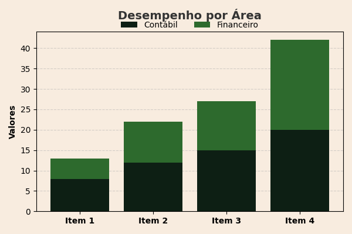
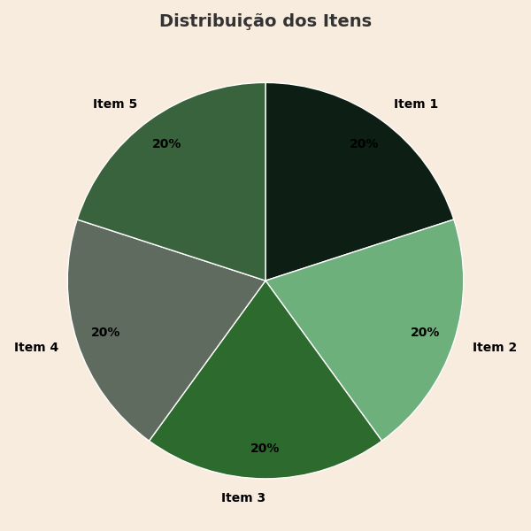

# 🖋️ Gerador de Documentos com Texto e Gráficos sobre Template PDF

Aplicação em Python que preenche automaticamente documentos PDF a partir de templates de imagem (um PNG por página). Com ela, é possível adicionar **textos personalizados**, **gráficos** e outros elementos visuais com posicionamento preciso.

Ideal para gerar certificados, relatórios dinâmicos, declarações, laudos ou qualquer documento automatizado com layout fixo.

---

## ✨ Funcionalidades

- 🖼️ Carrega templates de páginas em PNG
- ✍️ Adiciona textos com fonte, cor, alinhamento e posição configuráveis
- 📊 Insere gráficos como linhas, barras, pizza, etc.
- 📄 Exporta o resultado final como imagens ou PDF

---

## 📷 Exemplos de Gráficos Gerados

Abaixo estão alguns exemplos dos gráficos que podem ser adicionados e posicionados dinamicamente nas páginas do template:

<table align="center">
  <tr>
    <td align="center">
      <br>
      <sub><strong>Gráfico de Linha</strong><br>Juros Compostos</sub>
    </td>
    <td align="center">
      <br>
      <sub><strong>Gráfico de Barras</strong><br>Comparativo Mensal</sub>
    </td>
  </tr>
  <tr>
    <td align="center">
      <br>
      <sub><strong>Gráfico de Pizza</strong><br>Distribuição de Categorias</sub>
    </td>
    <td align="center">
      <br>
      <sub><strong>Gráfico de Linha</strong><br>Comparativo Mensal</sub>
    </td>
  </tr>
  <tr>
    <td colspan="2" align="center">
      <br>
      <sub><strong>Gráfico de Barras</strong><br>Resumo Consolidado</sub>
    </td>
  </tr>
</table>

> 💡 Você pode adicionar seus próprios gráficos e posicioná-los sobre qualquer página do template.

---

## 📄 Exemplos de PDFs Gerados

- [Exemplo 1 – Certificado de Participação](pdfs_exemplo/certificado1.pdf)
- [Exemplo 2 – Relatório de Desempenho](pdfs_exemplo/relatorio.pdf)
- [Exemplo 3 – Boletim Escolar](pdfs_exemplo/boletim.pdf)

> 💡 Esses exemplos demonstram diferentes tipos de conteúdo e layout.

---

## 🧪 Instalação

```bash
pip install -r requirements.txt
